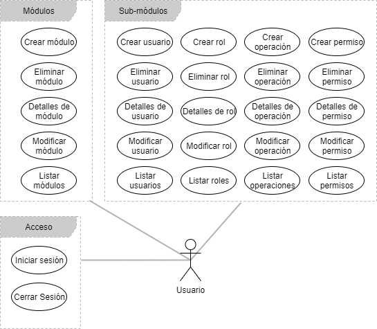
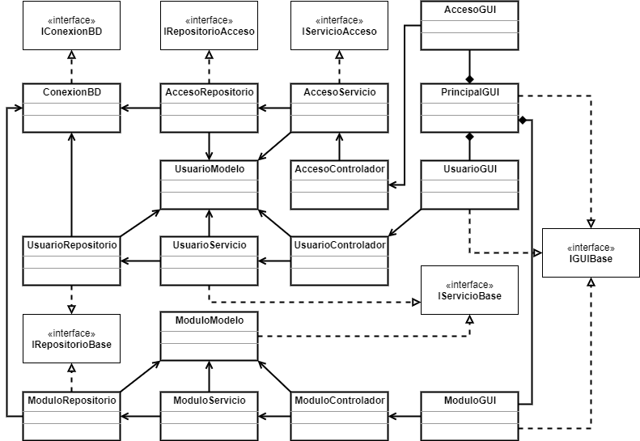
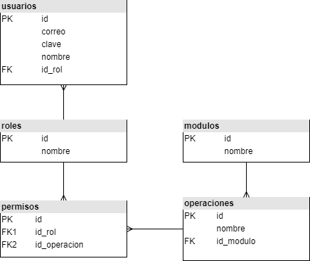
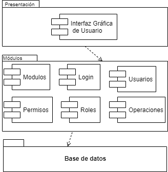
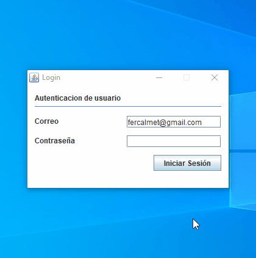

# Aplicación CRUD + Java + JavaSwing + SQL
> Autor : Fernando Calmet  
https://github.com/fernandocalmet  
----------

Esta aplicación de muestra está destinada a proporcionar un ejemplo práctico de una aplicación modular desarrollada por mi propio criterio. Específicamente, esta aplicación de muestra demuestra lo siguiente:

<ul>
	<li>Crear, Eliminar, Modificar, Listar Uno, Listar Todos y Busquedas con filtro de datos.</li>
	<li>Acceso de conexión y desconexión de usuarios al sistema.</li>
	<li>Capacidad de conexión con diferentes gestores de bases de datos. Se debe importar el driver de la biblioteca correspondientes para el uso de un gestor particular.</li>	
</ul>

Tenga en cuenta que si bien este programa de ejemplo funciona, las características mencionadas anteriormente no están destinadas a ser tomadas y utilizadas en aplicaciones comerciales de producción. En otras palabras, este no es un proyecto semilla para ser tomado  e implementado en su entorno de producción.
  

Por ejemplo, ciertos problemas no se abordan en absoluto en esta  muestra (por ejemplo, seguridad, privacidad, entre otros). En esta aplicación de muestra, se enfoca por lograr un equilibrio entre claridad, facilidad de mantenimiento y rendimiento. Sin embargo, la claridad es, en última instancia, la cualidad más importante en una aplicación de muestra.

Por lo tanto, hay ciertos casos en los que podríamos renunciar a una implementación más complicada (por ejemplo, el almacenamiento en caché de un valor de uso frecuente, un manejo robusto de errores, una estructura de modelo de dominio más genérico) a favor de un código que sea más fácil de leer. En ese sentido, agradezco cualquier comentario que haga que esta aplicación de muestra sean más fácil de aprender.

  
## Tabla de contenidos
* [Requerimientos](#requerimientos)
* [Diagrama de Casos de uso](#diagrama-de-casos-de-uso)
* [Diagrama de Clases](#diagrama-de-clases)
* [Diagrama de Datos](#diagrama-de-datos)
* [Diagrama de Componentes](#diagrama-de-componentes)
* [Diagrama de Despliegue](#diagrama-de-despliegue)
* [Demostración de la aplicación](#demostracion-de-la-aplicacion)
  
  
## Requerimientos
### Requerimientos Funcionales
- Conexión + Desconexión de acceso de usuarios
- Operaciones CRUD + Busqueda con filtro de datos

### Requerimientos No funcionales
1. Java JDK 1.8 [java-jdk](https://www.oracle.com/technetwork/java/javase/downloads/jdk8-downloads-2133151.html)
2. MySQL JDBC Driver [mysql-connector-java](https://dev.mysql.com/downloads/connector/j/)
3. Microsoft JDBC Driver [sql-jdbc](http://www.microsoft.com/en-us/download/details.aspx?displaylang=en&id=11774)
4. Oracle JDBC Driver [oracle-jdbc](http://www.oracle.com/technetwork/database/features/jdbc/index-091264.html)
5. Apache XAMPP [apachefriends.org](https://www.apachefriends.org/)
6. XAMMP: Servicio del modulo Apache
7. XAMMP: Servicio del modulo MySQL

## Diagrama de Casos de uso

## Diagrama de Clases

## Diagrama de Datos

## Diagrama de Componentes

## Diagrama de Despliegue

## Demostracion de la aplicacion

## BUY ME A COFFEE :-)
